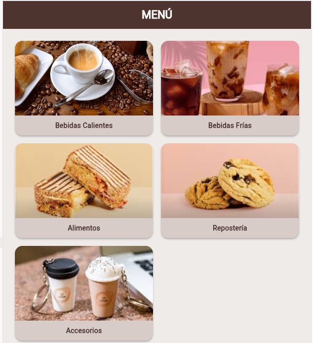
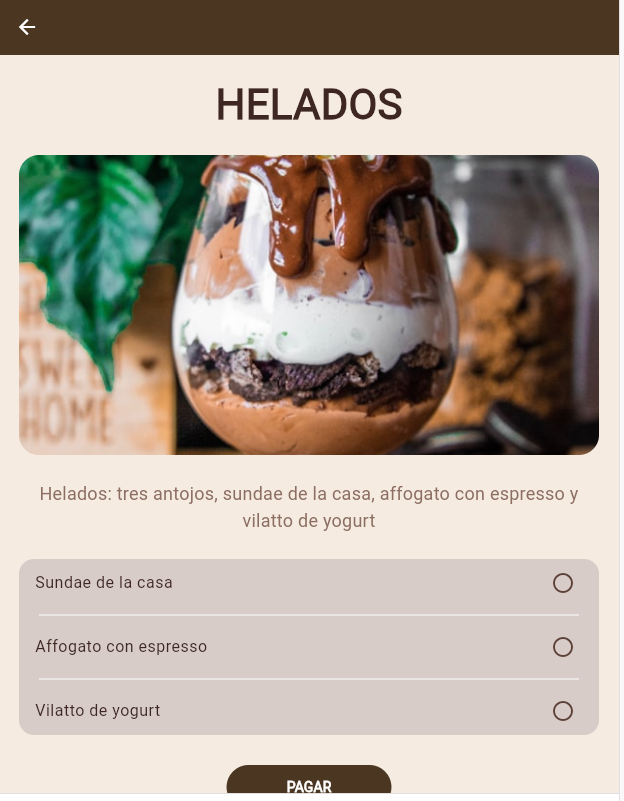
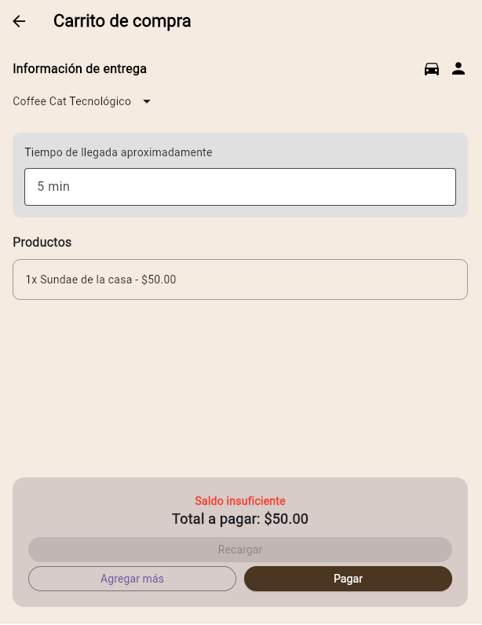
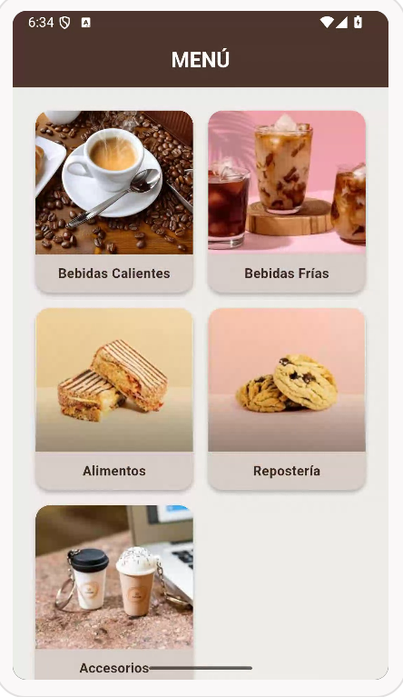
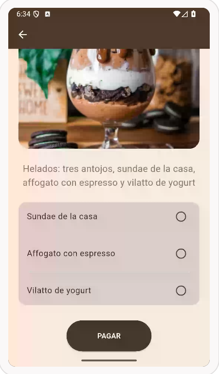
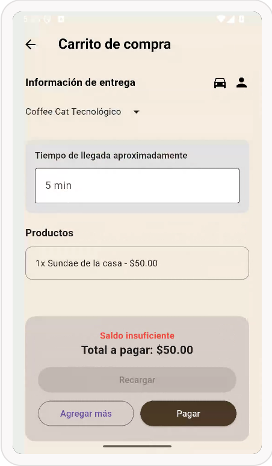

# Act 13 tres pantallas 
# Fernanda Lucia Aguirre Nava
# 6 J

lenguaje Dart flutter, juntar los siguientes codigos import 'package:flutter/material.dart';

void main() {
  runApp(const AppCafeteria());
}

class AppCafeteria extends StatelessWidget {
  const AppCafeteria({super.key});

  @override
  Widget build(BuildContext context) {
    return MaterialApp(
      debugShowCheckedModeBanner: false,
      home: const MenuPrincipal(),
    );
  }
}

class MenuPrincipal extends StatelessWidget {
  const MenuPrincipal({super.key});

  @override
  Widget build(BuildContext context) {
    return Scaffold(
      backgroundColor: const Color(0xFFEFEBE9), // Café muy claro (fondo)
      appBar: AppBar(
        title: const Text(
          'MENÚ',
          style: TextStyle(color: Colors.white, fontWeight: FontWeight.bold),
        ),
        centerTitle: true,
        backgroundColor: const Color(0xFF4E342E), // Café oscuro
      ),
      body: SingleChildScrollView(
        padding: const EdgeInsets.all(16.0),
        child: Column(
          children: [
            // FILA 1
            Row(
              children: [
                const TarjetaMenu(
                  titulo: 'Bebidas Calientes',
                  imageUrl: 'https://cdn.agenciasinc.es/var/ezwebin_site/storage/images/_aliases/img_1col/noticias/las-bebidas-muy-calientes-probable-causa-de-cancer-segun-la-oms/5720899-1-esl-MX/Las-bebidas-muy-calientes-probable-causa-de-cancer-segun-la-OMS.jpg',
                ),
                const TarjetaMenu(
                  titulo: 'Bebidas Frías',
                  imageUrl: 'https://raw.githubusercontent.com/navalucia/imagenes_cafetria/refs/heads/main/bebidas_frias.jpg',
                ),
              ],
            ),
            // FILA 2
            Row(
              children: [
                const TarjetaMenu(
                  titulo: 'Alimentos',
                  imageUrl: 'https://raw.githubusercontent.com/navalucia/imagenes_cafetria/refs/heads/main/alimentos.jpg',
                ),
                const TarjetaMenu(
                  titulo: 'Repostería',
                  imageUrl: 'https://raw.githubusercontent.com/navalucia/imagenes_cafetria/refs/heads/main/reposteria.jpg',
                ),
              ],
            ),
            // FILA 3
            Row(
              children: [
                const TarjetaMenu(
                  titulo: 'Accesorios',
                  imageUrl: 'https://raw.githubusercontent.com/navalucia/imagenes_cafetria/refs/heads/main/accesrorios.jpg',
                ),
                // Espacio vacío para mantener el tamaño de la columna izquierda
                Expanded(child: Container()),
              ],
            ),
          ],
        ),
      ),
    );
  }
}

class TarjetaMenu extends StatelessWidget {
  final String titulo;
  final String imageUrl;

  const TarjetaMenu({
    super.key,
    required this.titulo,
    required this.imageUrl,
  });

  @override
  Widget build(BuildContext context) {
    return Expanded(
      child: Card(
        color: const Color(0xFFD7CCC8), // Tono café claro para la tarjeta
        shape: RoundedRectangleBorder(borderRadius: BorderRadius.circular(15)),
        elevation: 3,
        margin: const EdgeInsets.all(8.0),
        child: Column(
          mainAxisSize: MainAxisSize.min,
          children: [
            // Imagen de la web
            ClipRRect(
              borderRadius: const BorderRadius.vertical(top: Radius.circular(15)),
              child: Image.network(
                imageUrl,
                height: 150,
                width: double.infinity,
                fit: BoxFit.cover,
                // Manejo de error por si el enlace falla
                errorBuilder: (context, error, stackTrace) => Container(
                  height: 150,
                  color: Colors.brown[200],
                  child: const Icon(Icons.coffee),
                ),
              ),
            ),
            // Texto de la categoría
            Padding(
              padding: const EdgeInsets.symmetric(vertical: 10, horizontal: 4),
              child: Text(
                titulo,
                textAlign: TextAlign.center,
                style: const TextStyle(
                  color: Color(0xFF3E2723), // Texto café oscuro
                  fontWeight: FontWeight.bold,
                  fontSize: 14,
                ),
              ),
            ),
          ],
        ),
      ),
    );
  }
} al darle click para seleccionar cualquiera te tiene que mandar a esta pantalla, que sera la segunda pantalla import 'package:flutter/material.dart';

void main() => runApp(const MiCafeteria());

class MiCafeteria extends StatelessWidget {
  const MiCafeteria({super.key});

  @override
  Widget build(BuildContext context) {
    // Definimos la URL de la imagen fija
    const String imageUrl = 'https://images.unsplash.com/photo-1563805042-7684c019e1cb?q=80&w=600';

    return MaterialApp(
      debugShowCheckedModeBanner: false,
      home: Scaffold(
        backgroundColor: const Color(0xFFF5EBE0), // Fondo crema
        appBar: AppBar(
          backgroundColor: const Color(0xFF4B3621), // Café oscuro
          elevation: 0,
        ),
        body: SingleChildScrollView(
          child: Column(
            children: [
              // 1. Título
              const Padding(
                padding: EdgeInsets.symmetric(vertical: 20),
                child: Text(
                  'HELADOS',
                  style: TextStyle(
                    fontSize: 32,
                    fontWeight: FontWeight.bold,
                    color: Color(0xFF3E2723),
                  ),
                ),
              ),

              // 2. Imagen usando imageUrl
              Padding(
                padding: const EdgeInsets.symmetric(horizontal: 20),
                child: ClipRRect(
                  borderRadius: BorderRadius.circular(20),
                  child: Image.network(
                    imageUrl,
                    height: 250,
                    width: double.infinity,
                    fit: BoxFit.cover,
                  ),
                ),
              ),

              // 3. Texto descriptivo
              const Padding(
                padding: EdgeInsets.all(25.0),
                child: Text(
                  'Helados: tres antojos, sundae de la casa, affogato con espresso y vilatto de yogurt',
                  textAlign: TextAlign.center,
                  style: TextStyle(
                    fontSize: 16, 
                    color: Color(0xFF8D6E63),
                    height: 1.5,
                  ),
                ),
              ),

              // 4. Lista estática con puntos a la derecha
              Container(
                margin: const EdgeInsets.symmetric(horizontal: 20),
                decoration: BoxDecoration(
                  color: const Color(0xFFD7CCC8), // Café claro
                  borderRadius: BorderRadius.circular(15),
                ),
                child: Column(
                  children: const [
                    ListTile(
                      title: Text('Sundae de la casa', style: TextStyle(color: Color(0xFF3E2723))),
                      trailing: Icon(Icons.radio_button_off, color: Color(0xFF5D4037)),
                    ),
                    Divider(color: Colors.white, indent: 20, endIndent: 20),
                    ListTile(
                      title: Text('Affogato con espresso', style: TextStyle(color: Color(0xFF3E2723))),
                      trailing: Icon(Icons.radio_button_off, color: Color(0xFF5D4037)),
                    ),
                    Divider(color: Colors.white, indent: 20, endIndent: 20),
                    ListTile(
                      title: Text('Vilatto de yogurt', style: TextStyle(color: Color(0xFF3E2723))),
                      trailing: Icon(Icons.radio_button_off, color: Color(0xFF5D4037)),
                    ),
                  ],
                ),
              ),
              const SizedBox(height: 30),
            ],
          ),
        ),
      ),
    );
  }
} pero agregale un boton que diga pagar, despues de darle click, te mande a una tercera panatalla, donde diga "carrito de compra" del lado izquierdo un icono de regreso, abajo del titulo un texto de color negro que diga "información de entrega" de su lado derecho dos iconos, uno de un carro y otro de una persona, abajo de eso un texto quedga "coffe cat tecnologico" junto con un boton despegable donde salga mas direcciones, en un contenedor gris poner con un texto que diga "tiempo de llegada aproximadamente" abajo poner una caja de texto donde pueda poner tiempo ej "5min", de bajo de ese contenedor poner "productos" y un contenedor donde salga el producto seleccionado, para finalizar un ultimo contenedor que diga "saldo insuficiente y el total a pagar, de bajo en el mismo contenedor un boton que no sirva que diga "recagarcar" debajo un boton que diga "agregar mas" y otro que diga "pagar", nivel principiante; ponle un comentario cada que inicie una panatlla 

# 3 pantallas de web 

# 3 panatallas Android 

